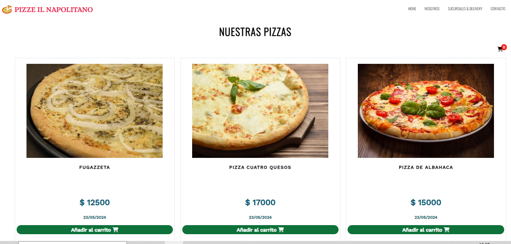

# Proyecto Pizzeria

Proyecto sobre un aplicación web para la de ventas de distintas pizzas.

## Caracteristicas

- Desarrollado con HTML/CSS 
- CSS Medias Querys
- Vanilla JavaScript

## Screenshots

## Autor

- [@Claudio Alonso](https://www.github.com/cealonso)

## License

[MIT](https://choosealicense.com/licenses/mit/)

